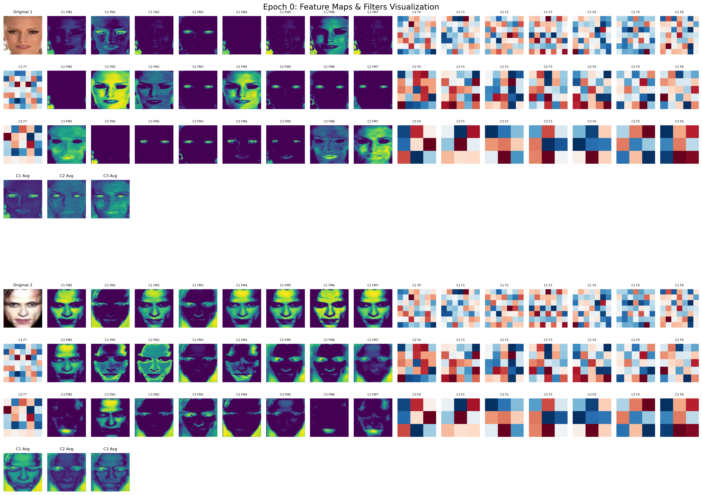
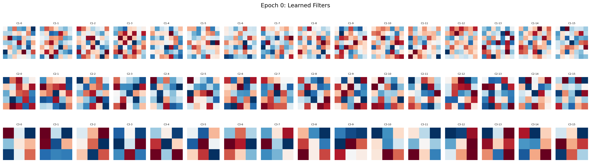

# Face Gender Detection with CNN Visualization

A PyTorch Lightning implementation of a Convolutional Neural Network for face gender classification with real-time feature map and filter visualization during training.

## 🎯 Project Overview

This project implements a deep learning solution for binary gender classification from facial images using a custom CNN architecture. The model includes comprehensive visualization tools to understand what the network learns at each convolutional layer during training.

## 🏗️ Architecture

### Model Structure
- **Input**: 512×512 RGB face images
- **Conv Layer 1**: 32 filters, 7×7 kernel, stride=2 (512→256)
- **Conv Layer 2**: 64 filters, 5×5 kernel, stride=2 (256→128) 
- **Conv Layer 3**: 128 filters, 3×3 kernel, stride=2 (128→64)
- **MaxPool**: 2×2, stride=2 (64→32)
- **Fully Connected**: 128×32×32 → 256 → 2 classes
- **Output**: Binary classification (Male/Female)

### Key Features
- **BatchNormalization** after each conv layer for stable training
- **ReLU activation** functions
- **Dropout (0.5)** for regularization
- **Adam optimizer** with StepLR scheduler
- **Real-time visualization** of feature maps and learned filters

## 📊 Visualization Features

The project includes comprehensive visualization tools that generate images during training:

### Feature Maps Visualization
Shows how the network processes images at each layer:
- **Original images** (denormalized for display)
- **Conv1 feature maps**: Early edge and texture detection
- **Conv2 feature maps**: Facial pattern recognition  
- **Conv3 feature maps**: High-level gender-specific features
- **Average feature maps**: Combined channel representations

### Filter Visualization
Displays the actual learned kernels/weights:
- **Conv1 filters**: Low-level feature detectors (edges, textures)
- **Conv2 filters**: Mid-level pattern detectors
- **Conv3 filters**: High-level feature detectors


*Example: Feature maps and filters visualization at epoch 0*


*Example: Learned filters visualization showing what each layer detects*

## 🚀 Getting Started

### Prerequisites
```bash
pip install torch torchvision pytorch-lightning matplotlib pillow
```

### Dataset Structure
```
datasets/
└── ashwingupta3012/
    └── male-and-female-faces-dataset/
        └── versions/1/
            └── Male and Female face dataset/
                ├── male/
                │   ├── image1.jpg
                │   └── ...
                └── female/
                    ├── image1.jpg
                    └── ...
```

### Training with Visualization
```bash
python main_visualize.py
```

### Inference Only
```bash
python main.py
```

## 📁 File Structure

```
Face-Gender-Detection/
├── main.py                    # Main training and inference script
├── main_visualize.py         # Training with visualization features
├── visuals/                  # Generated visualization images
│   ├── epoch_0.png          # Feature maps per epoch
│   ├── epoch_0_filters.png  # Filter visualizations
│   └── ...
├── model.pth                 # Saved model weights
├── test.png                  # Test image for inference
└── README.md
```

## 🔧 Configuration

### Data Preprocessing
```python
transforms = transforms.Compose([
    transforms.Resize((512, 512)),           # Resize to fixed dimensions
    transforms.ToTensor(),                   # Convert to tensor
    transforms.Normalize((0.5, 0.5, 0.5),   # Normalize to [-1, 1]
                        (0.5, 0.5, 0.5))
])
```

### Training Parameters
- **Batch Size**: 32
- **Learning Rate**: 0.001 (Adam optimizer)
- **Scheduler**: StepLR (decay by 0.1 every 10 epochs)
- **Max Epochs**: 10
- **Train/Val Split**: 80/20

## 📈 Model Performance

The model tracks training and validation loss with PyTorch Lightning's built-in logging:
- Real-time loss visualization in progress bars
- Automatic GPU/CPU device selection
- Mixed precision training support

## 🎨 Visualization Details

### Feature Map Interpretation
- **Bright areas (yellow)**: High activation regions
- **Dark areas (purple)**: Low activation regions
- **Progressive abstraction**: Conv1→Conv2→Conv3 shows increasing feature complexity

### Filter Interpretation
- **Red regions**: Positive weights
- **Blue regions**: Negative weights
- **Filter evolution**: Shows how kernels adapt during training

## 🔍 Usage Examples

### Training
```python
# Training with visualization
python main_visualize.py
```

### Inference
```python
# Place your test image as 'test.png' and run:
python main.py
# Follow prompts to classify images
```

### Expected Output
```
Predicted: female
Confidence: 87.34%
Probabilities: Female: 87.34%, Male: 12.66%
```

## 🛠️ Customization

### Modify Architecture
Edit the `imageCNN` class in `main_visualize.py`:
```python
# Change filter counts
self.conv1 = nn.Conv2d(3, 64, kernel_size=7, stride=2, padding=3)  # More filters

# Adjust learning rate
optimizer = optim.Adam(self.parameters(), lr=0.0001)  # Lower LR
```

### Visualization Frequency
```python
# Visualize every N epochs
if self.current_epoch % 5 == 0:  # Every 5 epochs instead of every epoch
    self.visualize_features()
```

## 📋 Technical Details

### Memory Optimization
- **Gradient detachment** for visualization tensors
- **Automatic mixed precision** support
- **Efficient data loading** with DataLoader

### Normalization Strategy
- Input normalization to [-1, 1] range
- BatchNorm after each convolution
- Proper denormalization for visualization

## 🤝 Contributing

1. Fork the repository
2. Create a feature branch
3. Make your changes
4. Add visualizations if applicable
5. Submit a pull request

## 📝 License

This project is open source and available under the MIT License.

## 🙏 Acknowledgments

- Dataset: Male and Female Faces Dataset
- Framework: PyTorch Lightning
- Visualization: Matplotlib

---

**Note**: Ensure the `visuals/` directory exists before training to save visualization images.