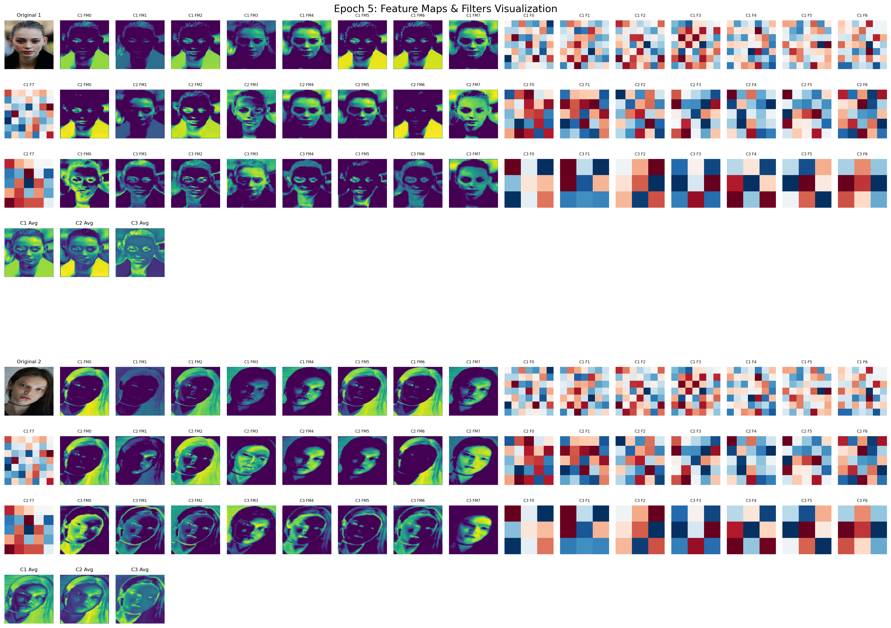
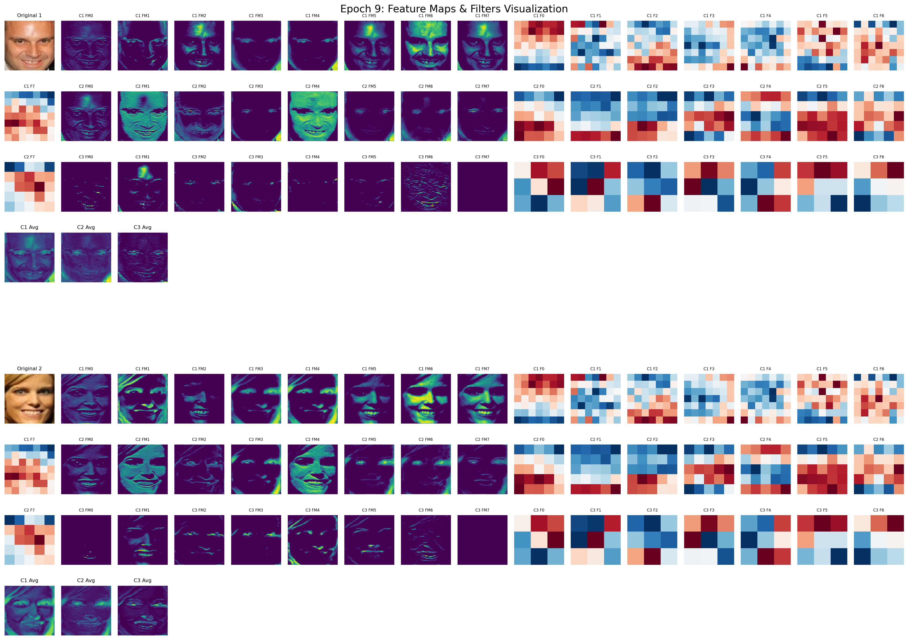
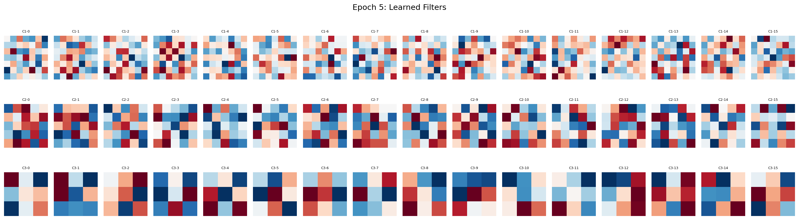
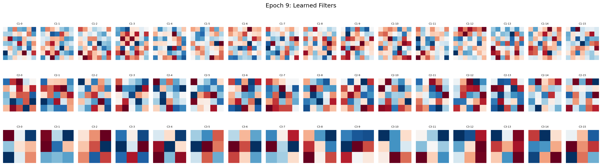

# Face Gender Detection with CNN

A gender classification model based on simple convolutional neural networks. It could predict the genders of the people in images based on details learned from the CNN.

## 🎯 Project Overview

This project uses the PyTorch Lightning implementation to create a convolutional neural network, which could do gender classification from facial images. The model also includes comprehensive visualization tools to help understand what the neural network is doing.

## 🏗️ Architecture

### Model Structure
- **Input**: 512×512 RGB face images
- **Conv Layer 1**: 32 filters, 7×7 kernel, stride=2 (512→256)
- **Conv Layer 2**: 64 filters, 5×5 kernel, stride=2 (256→128) 
- **Conv Layer 3**: 128 filters, 3×3 kernel, stride=2 (128→64)
- **MaxPool**: 2×2, stride=2 (64→32)
- **Fully Connected**: 128×32×32 → 256 → 2 classes
- **Output**: Binary classification (Male/Female)

## 🚀 Getting Started

### Requirements
```bash
pip install torch torchvision pytorch-lightning matplotlib pillow
```

### Dataset Structure
```
datasets/
└── cashutosh/
    └── gender-classification-dataset/
        └── versions/1/
            ├── Training/
            │   ├── male/
            │   │   ├── image1.jpg
            │   │   ├── image2.jpg
            │   │   └── ...
            │   └── female/
            │       ├── image1.jpg
            │       ├── image2.jpg
            │       └── ...
            └── Validation/
                ├── male/
                │   ├── val_image1.jpg
                │   ├── val_image2.jpg
                │   └── ...
                └── female/
                    ├── val_image1.jpg
                    ├── val_image2.jpg
                    └── ...
```

### Training with Visualization
```bash
python main_visualize.py
```

### Inference Only
```bash
python main.py
```

### Training Visuals

The model generates comprehensive visualizations during training to show how the network learns:

#### Feature Maps and Filters Visualization

*Feature maps and filters at epoch 0


*Feature maps and filters at epoch 5


*Feature maps and filters at epoch 9

#### Learned Filters Only

*Conv layer filters at epoch 0


*Conv layer filters at epoch 5


*Conv layer filters at epoch 9


## 📁 File Structure

```
Face-Gender-Detection/
├── main.py                    # Main training and inference script
├── main_visualize.py         # Training with visualization features
├── visuals/                  # Generated visualization images
│   ├── epoch_0.png          # Feature maps per epoch
│   ├── epoch_0_filters.png  # Filter visualizations
│   └── ...
├── model.pth                 # Saved model weights
├── test.png                  # Test image for inference
└── README.md
```

## 🔍 Usage Examples

### Training
```python
# Training with visualization
python main_visualize.py
```

### Inference
```python
# Place your test image as 'test.png' and run:
python main.py
# Follow prompts to classify images
```

### Expected Output
```
Predicted: female
Confidence: 87.34%
Probabilities: Female: 87.34%, Male: 12.66%
```
